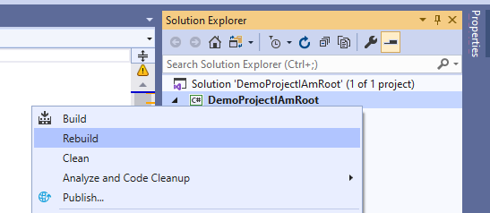

# IAmRoot NuGet Package [](https://www.nuget.org/packages/IAmRoot/)

This project demonstrates that any NuGet package can run arbitrary code on your machine.


> TL;DR; Installing NuGet packages **is** (_and have always been_) a security risk, and you should only install packages from trusted sources and trusted authors.


## Background

NuGet used to support PowerShell scripts that could be run manually by developers, or run automatically by NuGet, for example, after packages were installed (`install.ps1`) or uninstalled (`uninstall.ps1`), which was useful for packages that needed to perform an initial setup and clean-up things after, on uninstall.

With [NuGet v3](https://devblogs.microsoft.com/nuget/NuGet-3-What-and-Why/) and [`PackageReference`](https://devblogs.microsoft.com/nuget/NuGet-now-fully-integrated-into-MSBuild/), PowerShell script support was modified to no longer execute install and uninstall scripts, with one of the reasons being that they are [tightly-coupled to Visual Studio, and inheritantly not cross platform](https://twitter.com/terrajobst/status/1168206087402610688).

Microsoft didn't provide any real alternative or migration path from `install.ps1` causing [frustration](https://github.com/NuGet/Home/issues/6330) among developers and in September of 2017 the NuGet team started tracking an issue to [come up with a strategy for packages that have install.ps1/uninstall.ps1](https://github.com/NuGet/Home/issues/5963) which, as of this writing over two years later, didn't seem to have any progress.

In [discussions](https://github.com/NuGet/Home/issues/6330), **many developers seem to have the false sense that installing NuGet packages became a "safe" operation after Microsoft dropped support for executing PowerShell scripts (e.g. `install.ps1`), which is not true**.

> Installing NuGet packages **is** (_and have always been_) a security risk, and you should only install packages from trusted sources and trusted authors.


## How to Run

Add the **[IAmRoot](https://www.nuget.org/packages/IAmRoot/)** package from [nuget.org](https://www.nuget.org/packages/IAmRoot/) in any project:

```powershell
> dotnet add package IAmRoot
```
or
```powershell
PM> Install-Package IAmRoot
```

Build the project where the `IAmRoot` NuGet package was installed:



Your default internet browser should open and display the image below:


---

_Copyright &copy; 2019 Caio Proiete & Contributors - Provided under the [Apache License, Version 2.0](http://apache.org/licenses/LICENSE-2.0.html). Groot logo is a derivative of work by [Vectto](https://www.iconfinder.com/vectto) ([original](https://www.iconfinder.com/icons/2624888/fighting_free_free_groot_super_hero_icon))._
